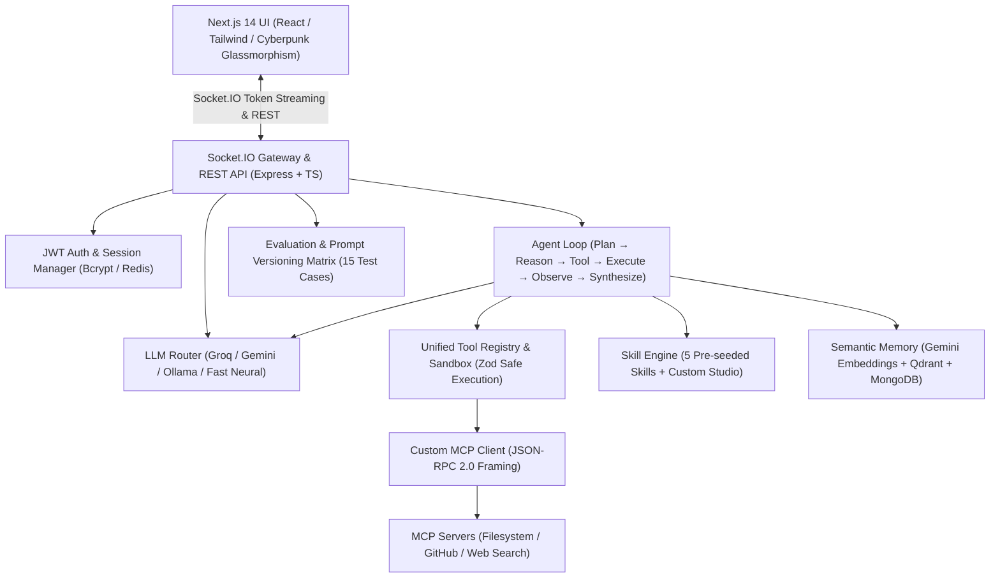

# ⚡ Heimdall — Autonomous AI Agent Platform

> Full-Scope, Production-Grade TypeScript AI Agent Platform featuring Multi-LLM Routing (Groq, Gemini, Ollama), Custom Autonomous Agent Loop, Model Context Protocol (MCP) Client & Servers, Sandboxed Tool Engine, Skills Studio, Semantic Vector Memory, and Automated Benchmark Evaluation Harness.

---

## 🏛️ Architecture Overview



---

## ✨ Key Platform Features

1. **Multi-Provider LLM Router & Streaming**
   - **Groq LPU**: Ultra-fast token streaming (`llama-3.3-70b-versatile`, `mixtral-8x7b-32768`).
   - **Google Gemini**: Deep reasoning & dense embeddings (`gemini-2.0-flash`, `gemini-1.5-pro`, `text-embedding-004`).
   - **Ollama**: First-class local model inference (`llama3.2`, `qwen2.5-coder`, `mistral`).
   - **Fast Neural / Offline Mode**: High-speed simulated streaming engine for zero-configuration testing.
   - Dynamic failover & retry chains with automatic provider fallback.

2. **Autonomous Cognitive Agent Loop**
   - Step cycle: **Plan → Reason → Select Tool → Execute in Sandbox → Observe → Synthesize → Repeat → Final Answer**.
   - Real-time **Agent Trace Panel** broadcasting step-by-step reasoning, tool JSON arguments, tool outputs, and latencies over Socket.IO.
   - Loop limits, timeout guards, and self-correction upon tool errors.

3. **Model Context Protocol (MCP) Support**
   - Custom TypeScript MCP client with standard JSON-RPC 2.0 framing and capability negotiation.
   - Built-in MCP Servers for **Filesystem**, **GitHub**, and **Web Search**.
   - Discovered MCP tools automatically reflected into the unified Tool Registry.

4. **Unified Tool Engine & Security Sandbox**
   - `calculator`: Safe mathematical computation using `mathjs`.
   - `weather`: Global live weather forecast retrieval via `wttr.in`.
   - `web_search`: Live internet search via Tavily & DuckDuckGo.
   - `filesystem`: Sandboxed read/write/list/delete operations scoped strictly to the sandbox workspace.
   - `mongodb_query`: Safe collection queries and aggregations.
   - `github`: Repository search, issues, commits, and file inspection.
   - `terminal`: Allowlisted command execution with timeout isolation.

5. **Skills Studio & 4 Seeded Personas**
   - Pre-seeded built-in skills:
     1. 🛡️ **Code Review Expert**: Architectural and security vulnerability analysis.
     2. 🐛 **Debugging Specialist**: Root-cause analysis and minimal reproduction patches.
     3. 🗄️ **SQL Architect**: Schema normalization, query optimization, and indexing plans.
     4. 🧭 **Research Assistant**: Web search evidence synthesis with verified citations.
   - Visual Skills Studio for creating, testing, and editing custom skills.

6. **Semantic Memory & Vector Search**
   - Embeddings generation on message persistence.
   - Hybrid search fusing Qdrant Cloud vector similarity and keyword indexes.
   - Automatic injection of relevant past context into prompt context windows.

7. **Evaluation Framework & Prompt Versioning**
   - 15 curated benchmark test cases across Coding, Reasoning, Math, Tool Use, Instruction Following, and Retrieval.
   - Automated multi-model benchmarking measuring Accuracy, Latency (P50/P90/Avg), Token consumption, and Cost ($/1k runs).
   - Prompt Versioning comparison and diff analysis.

---

## 🚀 Quick Start (Running Locally)

### 1. Install Dependencies & Build Packages
From the root directory:
```bash
# Install all workspace dependencies
npm install

# Build shared types package
npm run build --workspace=@heimdall/shared
```

### 2. Start Dev Servers (Client + Backend)
```bash
# Concurrently launches Server on port 4000 and Next.js Client on port 3000
npm run dev
```

Open [http://localhost:3000](http://localhost:3000) in your browser.

---

## 🔑 Optional Free-Tier Configuration

Heimdall operates out of the box with zero setup using resilient in-memory stores and offline neural fallbacks. To connect real cloud providers, copy `.env.example` to `.env` or configure keys directly in the UI Settings modal:

```env
# Primary LLM (Free API Key: https://console.groq.com)
GROQ_API_KEY=gsk_...

# Secondary LLM & Embeddings (Free API Key: https://aistudio.google.com)
GEMINI_API_KEY=AIzaSy...

# Local LLMs
OLLAMA_BASE_URL=http://127.0.0.1:11434

# MongoDB Atlas M0 (Free forever 512MB)
MONGODB_URI=mongodb+srv://...

# Upstash Redis (Free tier 10k commands/day)
UPSTASH_REDIS_REST_URL=https://...
UPSTASH_REDIS_REST_TOKEN=...

# Qdrant Cloud (Free tier 1GB cluster)
QDRANT_URL=https://...
QDRANT_API_KEY=...
```

---

## 📦 Project Monorepo Structure

```
heimdall/
├── package.json                   # Root monorepo runner
├── tsconfig.base.json             # Strict TypeScript configuration
├── packages/
│   └── shared/                    # 100% TypeScript DTOs, interfaces, and Zod schemas
├── server/                        # Express + Socket.IO + Mongoose + MCP backend
│   ├── src/
│   │   ├── agent/                 # Autonomous Agent Loop & real-time tracing
│   │   ├── auth/                  # JWT auth, bcrypt, middleware
│   │   ├── cache/                 # Redis & in-memory sliding rate limiter
│   │   ├── db/                    # Mongoose models & universal in-memory store
│   │   ├── eval/                  # 15-case benchmark harness & prompt versioning
│   │   ├── llm/                   # Groq, Gemini, Ollama, and Mock providers + Router
│   │   ├── mcp/                   # Custom MCP Client & Filesystem/GitHub/Web servers
│   │   ├── memory/                # Qdrant vector store & semantic search engine
│   │   ├── routes/                # REST API controllers
│   │   ├── skills/                # Skill engine & 5 pre-seeded personas
│   │   ├── socket/                # Real-time WebSocket streaming handlers
│   │   └── tools/                 # 7 sandboxed tools & unified registry
└── client/                        # Next.js 14 App Router + Tailwind frontend
    └── src/
        ├── app/                   # App Router pages & cyber styling
        ├── components/
        │   ├── agent/             # Live Agent Trace visualizer
        │   ├── chat/              # Chat pane, message items, code block with copy
        │   ├── eval/              # Model comparison matrix & benchmark dashboard
        │   ├── layout/            # Header with provider switcher & conversation sidebar
        │   ├── mcp/               # MCP server hub & live tool sandbox tester
        │   ├── memory/            # Semantic vector memory explorer
        │   ├── settings/          # API keys & subsystem diagnostics modal
        │   └── skills/            # Skills studio & editor
        └── lib/                   # Typed REST and Socket.IO clients
```

---

## 🧪 Verification & Testing

- **Backend Type-Check**: `npm run lint --workspace=server`
- **Frontend Type-Check**: `npm run lint --workspace=client`
- **Full Production Build**: `npm run build`
